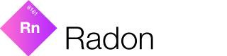

Radon is part of the **[E-sites iOS Suite](https://github.com/e-sites/iOS-Suite)**.

---

A lightweight framework to schedule and cancel local notifications.

[](http://forthebadge.com) [](http://forthebadge.com)

[](http://cocoadocs.org/docsets/Radon)
[](http://cocoadocs.org/docsets/Radon)
[](https://cocoapods.org/pods/Radon/quality)
[](https://travis-ci.org/e-sites/Radon)

> Inspired by [R.swift](https://github.com/mac-cain13/R.swift) by [Mathijs Kadijk](https://github.com/mac-cain13). 👏   
> The difference between R.swift and this one, is that it only looks for images and has a special `--watch` parameter.

# Installation

## Cocoapods

Podfile:

```ruby
pod 'Radon'
```

And then

```
pod install
```

## Manual

Just download the [radon](https://github.com/e-sites/Radon/raw/master/bin/radon) binary and put it anywhere you like.

# Generating

Just run:

```
$ Pods/Radon/bin/radon
```

With the following options:

```
Usage: Pods/Radon/bin/radon [options]
  -f, --folder:
      The folder to scan
  -o, --output:
      The folder to write the R.swift file to
  -w, --watch:
      Automatically watch the 'folder'
```

With the `--watch` option the cli app wil automatically scan the folder and generate the Radon files when any changes have been made inside that folder.

So for instance:

```
$ Pods/Radon/bin/radon --folder ./Resources/ --output ./Classes/Generated/ --watch
```

This will generate two files:

- Radon.swift
- Radon+images.swift

You can use these two files in your project.

See the [example project](https://github.com/e-sites/Radon/tree/master/RadonExample) for more information.

# Usage

```swift
let image = Radon.images.assets.icons.ironMan
    
let imageView = UIImageView(image: image)
imageView.frame = CGRect(x: 50, y: 50, width: 100, height: 100)
self.view.addSubview(imageView)
```

For your convenience you can also use the shorthand [R.swift](https://github.com/mac-cain13/R.swift) notation.

```swift
typealias R = Radon
```